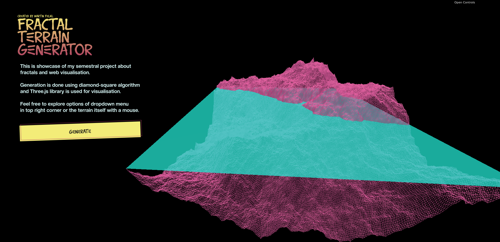
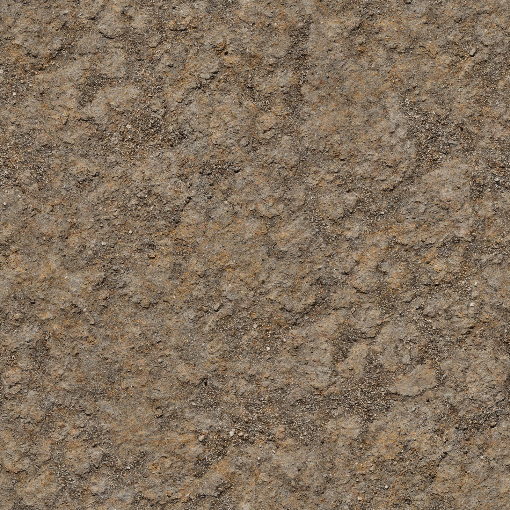
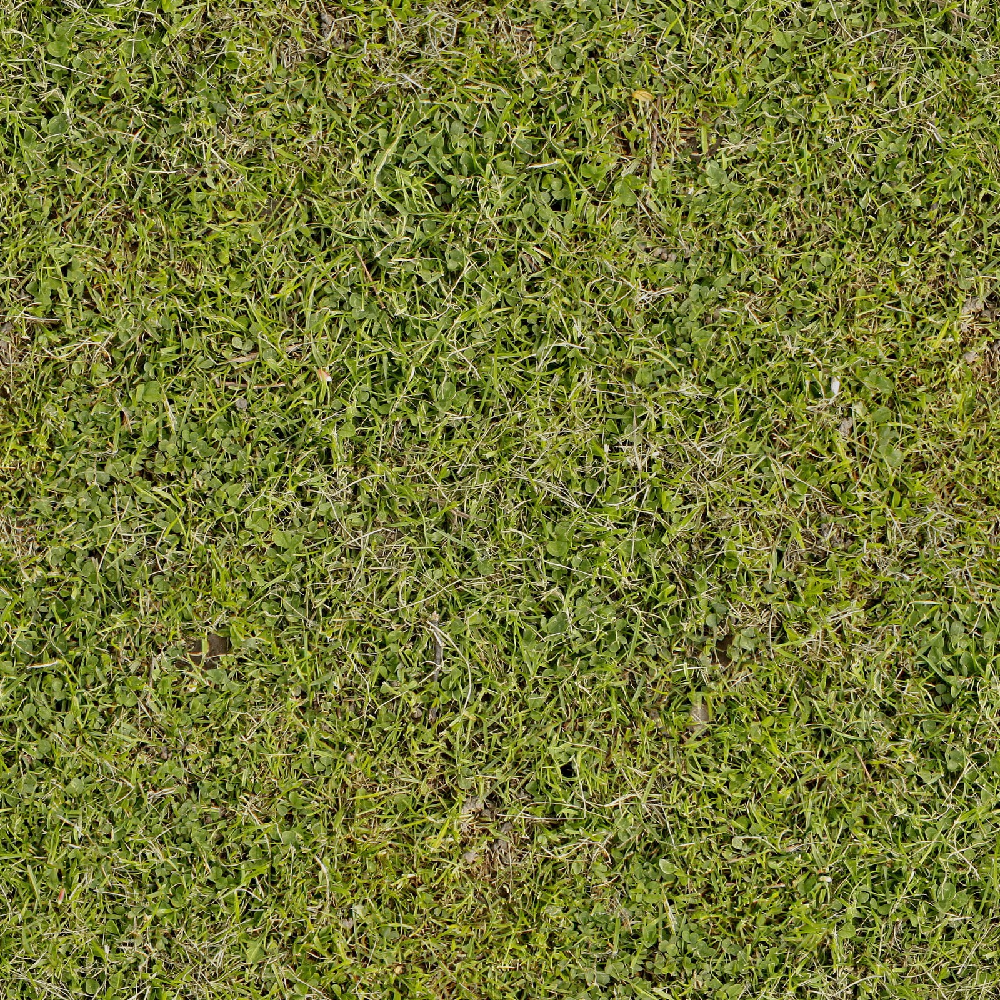
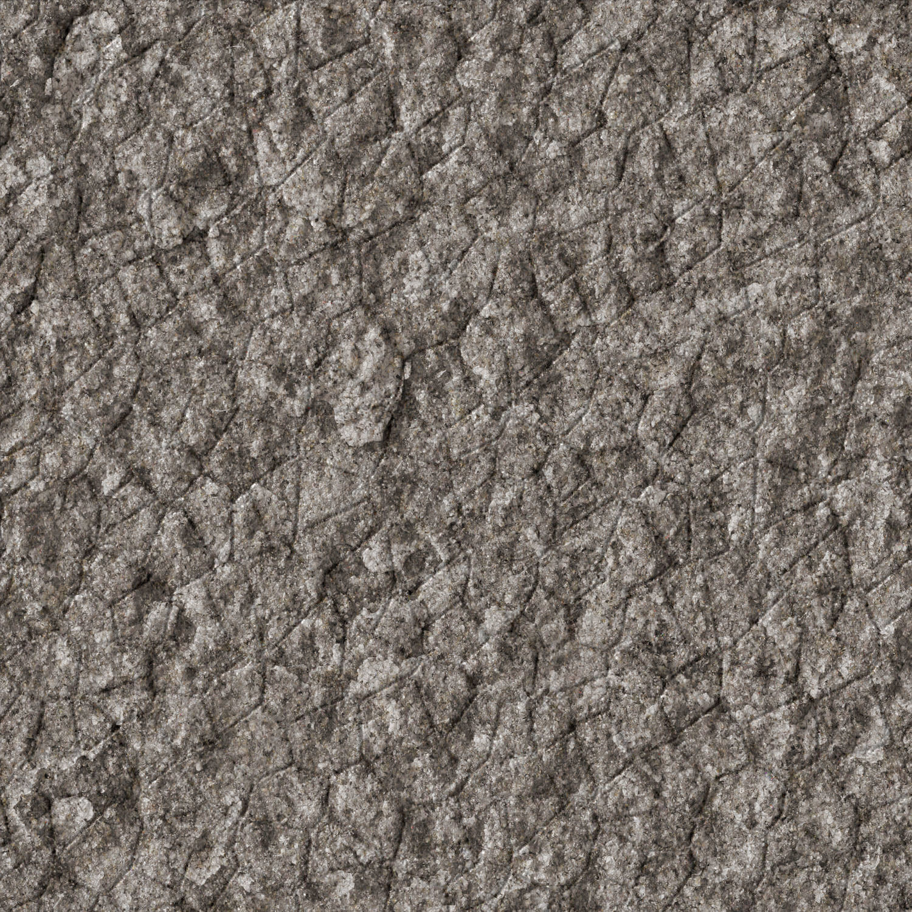
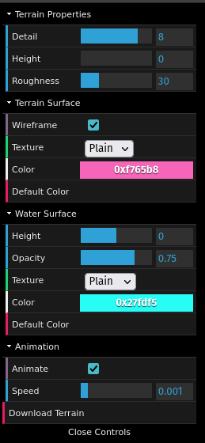
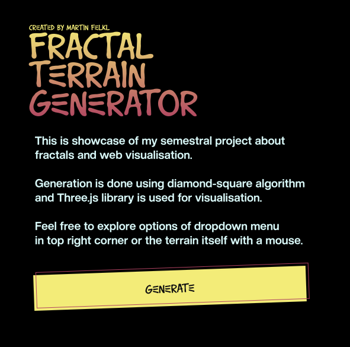
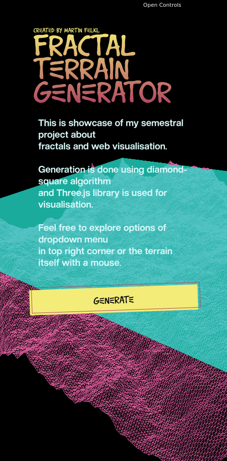
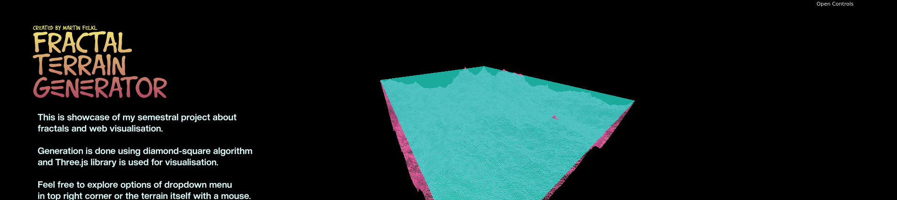

# **Fractal Terrain Generator**

## Introduction

From the available topics for the term project, I chose **fractals**, which I combined with the topic of **web rendering**. To fully cover these chosen topics, I created a fractal terrain generator visualized on the web using the Three.js library.

Project Structure:

- Index.html
- fonts - fonts used for the heading and text
  - BASQUIAT.otf
  - Printvetica.otf
- modules
  - dat.gui.module.js
  - GLTFExporter.js
  - main.js - the main file containing my code for terrain generation
  - OrbitControls.js
  - three.module.js
- style
  - reset.css - resets element styling to ensure the page layout renders more consistently across different web browsers
  - styl.css - the layout and styling of the web page itself
- textures - textures applied to mesh objects
  - dirt.jpg
  - grass.jpg
  - rock.jpg
  - snow.jpg
  - water.jpg

## Scene Preparation

Properly configuring the scene is crucial; otherwise, it would be impossible to visualize the terrain. First, the renderer is created and initialized, with its dimensions dynamically scaled to match the browser window. Next, a `Scene` object is instantiated, acting as the virtual space where all other components are injected. A camera is immediately appended to the scene so that viewport elements become visible. Alongside the camera, two light objects are introduced straight away: an `AmbientLight` and a `DirectionalLight`. All of these objects are native components of the Three.js library.

To make interacting with the generated terrain possible, I also included `OrbitControls` from the Three.js library ecosystem, allowing users to manipulate the scene layout using a mouse:

- Right mouse button - rotates the terrain
- Left mouse button - pans/translates the terrain view
- Mouse scroll wheel - zooms in/out

## Terrain Class

The terrain architecture itself is represented using the custom `Terrain` class, which encapsulates parameters for structural mesh details, the maximum potential corner height boundaries, and its surface roughness values. It also controls the distinct mesh models for both the ground terrain and water level components. The water surface mesh is initialized directly inside the constructor structure, whereas the terrain surface is created via explicit execution calls to the `generate` method. Additionally, the class holds default color metrics and surface textures. These asset images are loaded from the `textures/` root directory during instantiation and are calculated to wrap precisely across the target terrain map or water baseline grid.

### Texture Showcases

## Terrain Generation Logic

The initialization sequence loops by first clearing old terrain mesh files out of memory and subsequently building and binding a clean mesh alternative in its place. This rendering asset is derived from newly allocated `PlaneGeometry` objects combined with a custom `MeshPhongMaterial` track assigned to class instance variables. The underlying `PlaneGeometry` uses fixed dimensional boundaries of 100x100, while its peripheral borders are sliced into sub-segments. The total segment count remains proportional on both horizontal and vertical axes depending entirely on the chosen depth detail configuration, which steps incrementally by powers of two. For example, selecting a detail limit of 3 splits every bounding layout side into 8 individual mesh segments. This geometric division sets up a coordinate vertex grid across the surface plane before individual height indices are manipulated. Every grid intersection point is tracked using classic X, Y, and Z coordinate properties; while the base horizontal positions (X and Y parameters) are left unmodified, the vertical axis factor (Z component) is actively swapped for a target value extracted from an array tracking generated coordinate heights. This numerical height layout dataset is generated using the [Diamond-Square Algorithm](https://en.wikipedia.org/wiki/Diamond-square_algorithm).

The foundational logic of this algorithmic layout is documented thoroughly on Wikipedia, so I will highlight only a few distinct custom nuances implemented here. The routine runs calculations over a square array matrix that records index numbers tracking surface elevations. Instead of allocating a classic multi-dimensional array variable setup, I chose to maintain a flat one-dimensional array layout mapped mathematically to reflect a standard coordinate matrix grid structure. Element components are tracked and indexed through a straightforward array lookup computation: **`row_index * matrix_width + column_index`**. This flat architecture significantly streamlined array loop lookups when assigning calculated values to surface vertices later on, as described above.

During each execution step of the algorithm loop, target node elevations evaluate mathematically as the calculated mean height of the surrounding square or diamond node corners, modified by combining a randomly generated coordinate offset index. My execution path deviates slightly from the generic Wikipedia baseline configuration by calculating random variance values mapped between a specified array bounds configuration spanning from `-roughness` to `roughness`. The tracking boundary range constraint variable is automatically scaled down to half its value following the resolution of each distinct square and diamond calculation iteration, which prevents excessive spikes or unrealistic height anomalies from throwing off the terrain model map.

It is also worth highlighting how primary starting matrix heights are set up initially. Their baseline positions rely heavily on the `max_init_height` execution variable parameter, which limits the maximum scaling elevation allowed for the main bounding corners. The initialization range of these core index corners samples freely from an established numeric variance layout spanning the interval `(0, max_init_height)`.

## Graphic User Interface (GUI)

To allow real-time interactive adjustments to the terrain characteristics, I integrated a simple graphic user interface menu into the web workspace using the `dat.GUI` library system. The parameters dashboard controls all adjustable terrain generation options and drops down from the upper right-hand viewport layout layer. Users can access this workspace directly by selecting the **Open Controls** button toggle. The control interface splits into four separate sub-tabs tracking these specific system modules:

- **Terrain Properties** - adjusting these fields triggers a fresh terrain generation cycle immediately:
  - **Detail**: Powers of two scaling limits ranging from 0 to 10; determines plane surface segments and mesh density (higher values yield sharper surface detail).
  - **Height**: Restricts the maximum target vertex height scaling factor allowed across surface plane corner coordinates.
  - **Roughness**: Adjusts structural terrain displacement variance limits (higher inputs introduce rugged mountain terrain profiles).
- **Terrain Surface**:
  - **Wireframe**: A Boolean interface switch that renders the entire scene geometry model inside a skeletal vector mesh wireframe view.
  - **Texture**: Changes the applied visual map covering the mesh (options include plain color fills, dirt maps, rocky surfaces, grass sheets, and snow cap styles).
  - **Color**: Modifies base ground color tint overlays.
  - **Default Color**: Reverts terrain base rendering configurations to their standard factory preset shades.
- **Water Surface**:
  - **Height**: Slides the overall height placement position of the global liquid mesh model layer.
  - **Opacity**: Adjusts alpha blend settings tracking liquid face opacity metrics (clamping this input to 0 turns off water rendering completely).
  - **Texture**: Swaps the current layout configuration layer between plain shading styles or a dedicated liquid map texture (`plain`, `water`).
  - **Color**: Tweaks the direct base color tracking of the ocean/lake surface structures.
  - **Default Color**: Reverts default water surface rendering assignments back to factory preset colors.
- **Animation**:
  - **Animate**: A system toggle switch that activates or deactivates continuous geometric rotation loops for the scene mesh.
  - **Speed**: Speeds up or slows down the continuous model rotation cycles.
- **Download Terrain**: Allows immediate file structure exports of the complete virtual web viewport space into a standard `.scene.glb` model document format.

When a new asset graphic file texture is assigned, the underlying ground terrain or liquid color metric clears to white automatically. This resets the canvas layer so the detailed pixel data displays clean and unskewed by pre-existing color layers, while still allowing users to apply custom secondary tints afterward.

## Visual Layout & Web Presentation

To build an engaging web platform layout presentation, I introduced text titles, brief introductory summaries, and user execution buttons whose overall layout structures were polished using a dedicated styling sheet file template named `style.css`. The functional system was developed and tested locally within a Mozilla Firefox browser ecosystem. However, subsequent rendering validations across Google Chrome highlighted distinct subtle visual deviations in text font weights and rendering treatments. To circumvent this cross-browser platform issue, I integrated a dedicated layout standard reset file structure called `reset.css`. This module runs immediately before the production styles template (`style.css`) evaluates, neutralizing individual web engine default element margins to establish consistent visual presentation uniformity across all active browser types.

The integrated `reset.css` stylesheet structure was adapted from Eric Meyer's public web architecture resources, accessible at http://meyerweb.com/eric/tools/css/reset/.

The primary application styling setup inside `style.css` was written from scratch to frame all web presentation layouts to my precise target specifications. The explicit visual style rule tracking configuration for the main interactive button layout was adapted from library styling assets hosted on https://getcssscan.com/css-buttons-examples and tailored slightly to fit my project theme. The target button handles a straightforward browser task layout routine: it triggers a full webpage reload event, instantly recalculating and rendering a brand-new random fractal mountain landscape asset configuration.

To support dynamic cross-device support, I implemented a custom `on_window_resize` window handler method layout routine. This system listens for adjustments to browser screen shapes and updates render aspect matrices, maintaining perfect scaling distributions without visual stretching or resolution warping when dimensions change.

## Conclusion

The project objectives were met successfully, and building this web engine served as an exceptionally rewarding technical milestone, as I had no prior coding exposure to modern web architecture systems or native JavaScript environments before this assignment. I must admit that the initial phases left me feeling somewhat lost regarding structural design implementations; however, by the conclusion of the development cycle, working with raw JavaScript alongside the Three.js and `dat.GUI` software ecosystems felt highly intuitive. Writing this application was thoroughly engaging while equipping me with a solid foundational entry point into web systems programming and interface design strategies.

The complete live project deployment build is hosted and publicly accessible via GitHub Pages at: https://felklmar.github.io/
